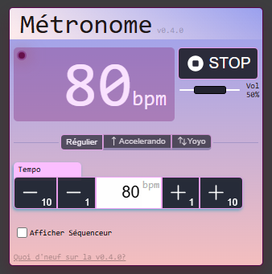

# Metrobeat

## Introduction

Metrobeat is a simple single-page web app that provides some metronome functionnalitites.

> The app is deployed at https://metrobeat.42borgata.com.

Features:
- Regular metronome (tick at a given bpm)
- Mode accelerando (accelerates from a start to a target bpm and maintains it)
- Mode zig-zag (oscillates between two bpm)



## How to use?


## How to run the app localy?


### Installation

Prerequisites:
- Install `NodeJS`

From a terminal, run the following commands:

```
git clone https://github.com/berdal84/metrobeat.git
cd metrobeat
npm install
```

### Execution

Prerequisites:
- Follow the Installation steps above.

From the installation directory, run this command in a terminal:
```
npm start
```

The terminal should display some outputs, and invites you to browse http://localhost:4173/ to access the metronome.

## Credits

This application has been developed to learn about metronomes and as a gift for my brother Florent who was looking for an app similar to this one. Thanks to him for his help fixing the program.